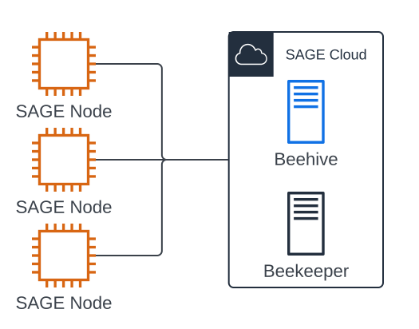
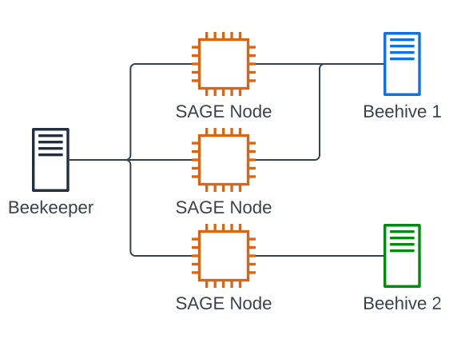
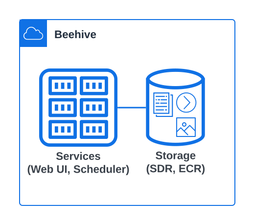
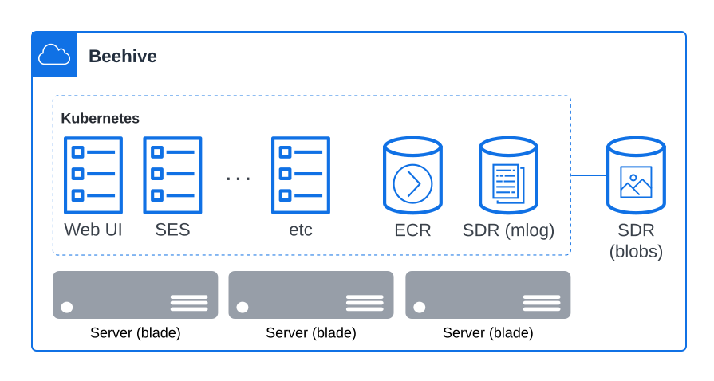

# Architecture (new)

The architecture of the Sage cyberinfrastructure can be best explained by doing a Google Maps style zoom-in of the architecture. We will start by understanding the infrastructure at the highest-level first, zooming into each component to understand how all the components work together.

## High-Level Infrastructure

The Sage infrastucture is made up of 2 main components:
- the Sage Nodes that exist at the edge (TODO: link to lower in this doc)
- the Sage Cloud  (TODO: link to lower in this doc) that hosts services and storage systems to facilitates running plugins (TODO: link to "compute at the edge") @ the edge

Every edge node has 2 connections to the Sage Cloud: 1 to a Beehive (TODO: linkt to Beehive) and 1 to the one-and-only Beekeeper (TODO: link to beekeper)

### Beekeeper

The Beekeeper is an administrative server that allows Sage administrators to perform actions on the nodes such as gather health metrics, and perform software updates.  All Sage nodes "phone home" to the Beekeeper and maintain this "life-line" connection.

### Beehive

The Sage node / Beehive connection is the pipeline for the science. It is over this connection that instructions for the node will be sent, in addition to how data is published into the Beehive storage systems from plugins (TODO: link to plugins) running on the nodes.

The infrastructure supports multiple Beehives, where Sage nodes are associated with a single Beehive. The set of nodes associated with a Beehive creates a "colony" where each "colony" is separate, having its own data store, web services, etc.

In the example in Figure 2, there are 2 Sage nodes associated with Beehive 1, while 1 Sage node is associated with Beehive 2.  While all Sage nodes establish a "life-line" to the single Beekeeper (TODO link to Beekeeper).

## Beehive Infrastructure

The Sage Beehive contains 2 main components:
- software services such as the Sage Edge Scheduler (SES) (TODO link), data APIs, and website hosting
- data storage systems such as the Sage Data Repository (TODO link) and the Edge Code Repository (TODO link)

The Beehive is the “command center” for interacting with the Sage nodes at the edge. Hosting websites and interfaces allowing scientists to create “science goals” (TODO link) to run plugins (TODO link) at the edge & browse the data produced by those plugins.

A Beehive cloud data center would consist of multiple server machines running a shared file system with kubernetes (TODO link) handling redundancy and service replication.

## Sage Nodes

LEFT OFF HERE

The Sage nodes make minimal autonomous decisions themselves, relying on decisions

### Beehive Software Services TODO

## Sage Data Repository (SDR)
for housing edge produced data
- Is the storage systems technology that houses all edge produced data
access to this data is available through the Beehive hosted “data-api” services and a data browsing website

talk about OSN
Additionally, for this setup we are making use of the Open Storage Network (or OSN) for storing the large blobular data (such as images, audio, video and AI/ML models)

## Sage Edge Scheduler (SES)

## Edge Code Repository (ECR)
for hosting edge plugins
is a Docker registry that the edge nodes pull from when running plugins at the edge
